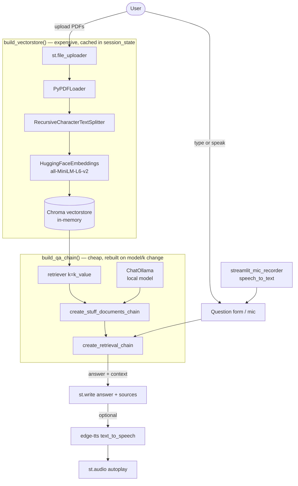

# Mini_RAG_PDF_Reader_QA.md — Mini RAG PDF Reader Q&A

Developer/agent guidance for this project. User-facing setup lives in [README.md](README.md).

## Architecture



## Layout

Single-file app. All logic is in [app.py](app.py); config in [.streamlit/config.toml](.streamlit/config.toml).

## Key invariants

- **Session-state caching is the core performance contract.** `vectorstore` is rebuilt only when the file signature (`(name, size)` per file) or `chunk_size` changes; `qa_chain` is rebuilt only when `model_name` or `k_value` changes. Preserve this split — do not embed on every rerun.
- **Everything runs local + free** except `edge-tts` (needs internet). Embeddings (HuggingFace), vector store (Chroma), and the LLM (Ollama) require no API keys.
- **The Ollama model must be pulled first** (`ollama pull <model>`); the selectbox only lists names.
- **Chroma is in-memory** — it does not persist across process restarts.

## Actionable notes for changes

- Adding a model: extend the `st.selectbox` list in the sidebar; ensure it is `ollama pull`-able.
- Changing retrieval quality: adjust `chunk_size`/`chunk_overlap` in `build_vectorstore` or `k` in `build_qa_chain`. Changing `chunk_size` forces a re-embed (by design).
- The question box is inside `st.form("qa_form")` so Enter submits — keep the submit button as `st.form_submit_button`, not `st.button`.
- Voice input path: `speech_to_text` → sets `query_text` + `auto_run` → `st.rerun()` → answered on the clean pass. Don't answer inside the mic component's own rerun.
- TTS language auto-detects Bengali via the `[ঀ-৿]` range, else English; extend `VOICES` to add languages.
- New deps go in [requirements.txt](requirements.txt) (unpinned, matching current style).

## Run

```bash
streamlit run app.py
```

Requires a running Ollama daemon with at least one listed model pulled.
